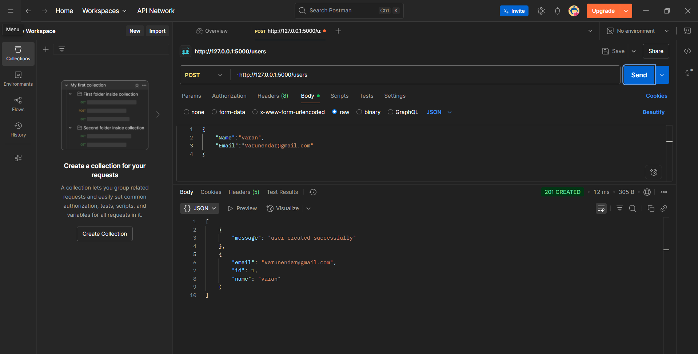
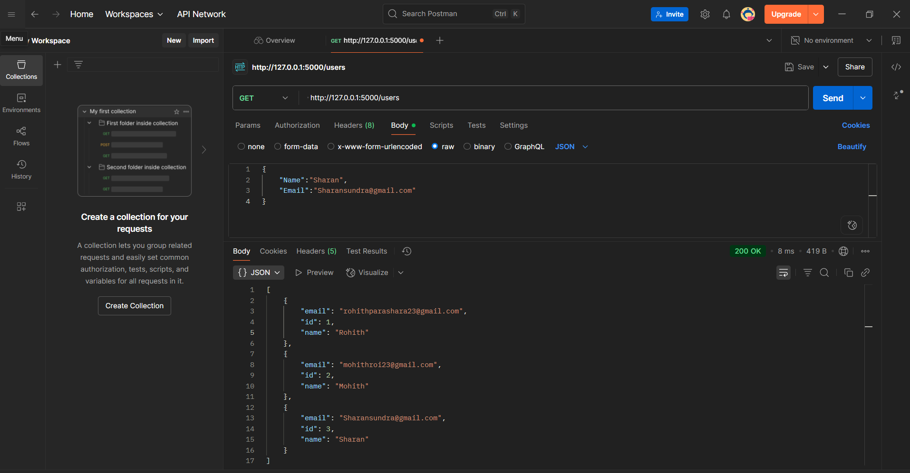
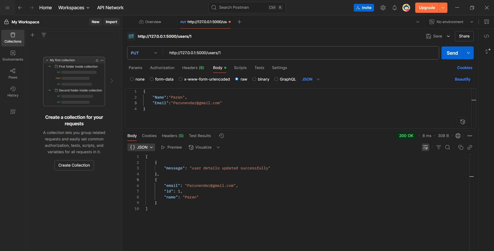
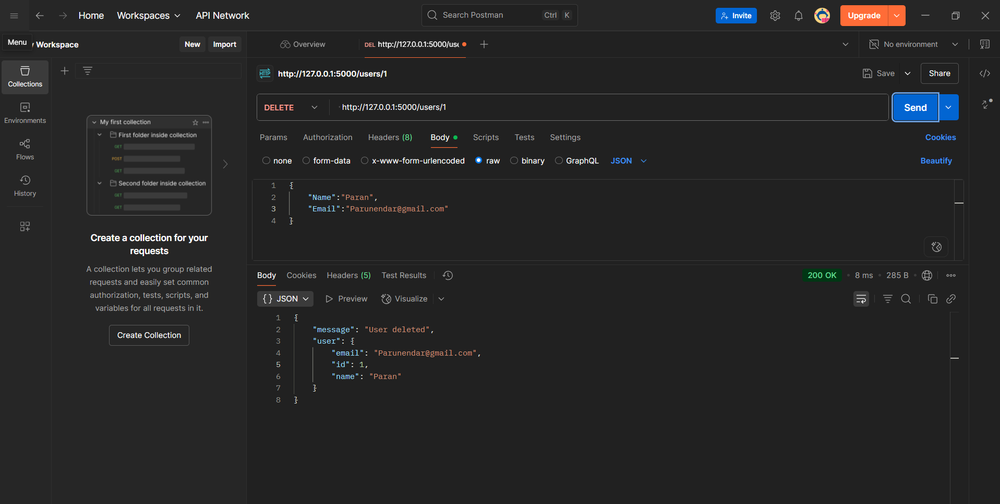

# task4-rest-api

---

# 🚀 Task 4: Build a REST API with Flask

## 📌 Objective

The objective of this task is to create a RESTful API using Python's Flask framework that performs CRUD (Create, Read, Update, Delete) operations on user data. The API uses in-memory storage (a simple list) for managing users and supports HTTP methods: POST, GET, PUT, and DELETE.

---

## 🛠 Tools Used

- *Language:* Python
- *Framework:* Flask
- *API Testing Tool:* Postman
- *IDE:* VS Code
- *Platform:* Localhost (127.0.0.1:5000)

---

## 📂 Project Structure

task-4-rest-api/ ├── app.py                 # Flask application ├── README.md              └── screenshots/           # Postman API testing screenshots ├── post-create-user.png ├── get-all-users.png ├── put-update-user.png └── delete-user.png

---

## 🔥 Features

- Add new users using POST /users
- Get a list of all users using GET /users
- Update a specific user by ID using PUT /users/<id>
- Delete a user by ID using DELETE /users/<id>
- JSON responses with meaningful status codes
- Handles both lowercase and capitalized JSON keys ("name" or "Name")

---

## ⚙ How to Run This Project

1. Open terminal and install Flask:

pip install flask

2. Run the Flask app:

python app.py

3. Open *Postman* and test the API using:

http://127.0.0.1:5000/

---

## 🧠 Code Explanation (Line by Line)

*Importing Modules:*  
We start by importing Flask and its required classes: Flask, request, and jsonify to create and handle web routes and responses.

*Initializing App:*  
We create a Flask app instance using app = Flask(__name__).

*In-Memory Database:*  
We define a Python list users = [] which stores user dictionaries containing id, name, and email.

---

### POST /users – Add New User

- This route accepts JSON data via POST.
- It checks for either lowercase or capitalized keys (name or Name, email or Email).
- If either field is missing, it returns a 400 Bad Request.
- Otherwise, it creates a user, assigns an incremental ID, and appends it to the list.
- Returns 201 Created with user data.

---

### GET /users – Get All Users

- Returns the entire list of users.
- Responds with 200 OK.

---

### GET /users/<id> – Get User by ID

- Accepts a user ID as a path parameter.
- Searches for the user with that ID.
- If found, returns the user data.
- If not found, returns 404 Not Found.

---

### PUT /users/<id> – Update User

- Accepts user ID and JSON payload.
- Checks if the user exists.
- Updates name or email if present in the payload (case-insensitive).
- Returns updated user with 200 OK.

---

### DELETE /users/<id> – Delete User

- Accepts user ID as a parameter.
- Removes the user from the list if they exist.
- Responds with confirmation message and 200 OK.

---

## ✅ API Endpoints Summary

| Method | Endpoint             | Description               |
|--------|----------------------|---------------------------|
| POST   | /users             | Create a new user         |
| GET    | /users             | Get all users             |
| GET    | /users/<id>        | Get a user by ID          |
| PUT    | /users/<id>        | Update user by ID         |
| DELETE | /users/<id>        | Delete user by ID         |

---

## 📸 Screenshots

All API requests were successfully tested in *Postman*.

| Method | Screenshot |
|--------|------------|
| ✅ POST - Create User |  |
| ✅ GET - All Users    |  |
| ✅ PUT - Update User  |  |
| ✅ DELETE - Remove User |  |

Each screenshot clearly displays:
- Correct request URL and method
- Proper headers and JSON body
- Successful status codes (200 OK, 201 Created)
- Valid JSON responses

---

## Conclusion

- 💡 Fully working REST API using Flask
- 🔄 Supports all HTTP methods with complete CRUD functionality
- 💬 User-friendly error messages and validations
- 🧠 Accepts both name/Name and email/Email inputs for flexibility
- 📸 Well-documented Postman results with proof screenshots
- 🧾 Professionally written README.md with full explanations
- 💻 Clean, maintainable, and scalable Python code

---

## 👨‍💻 Developer Info

*Name:* Rohith K N  
*Internship:* Python Development (1 Month)  
*Task Number:* Task 4 - REST API using Flask  
*Date:* June 2025  
*Goal:* Top 10 out of 200 interns ✨

---
